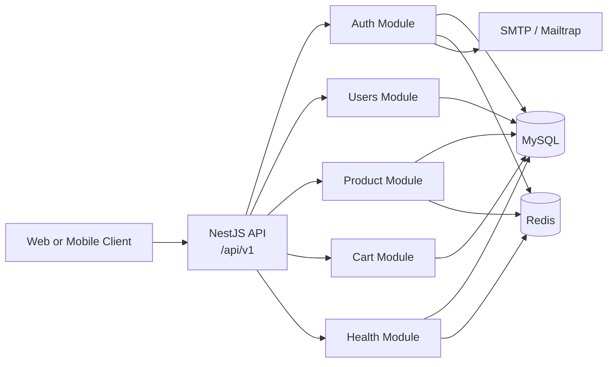
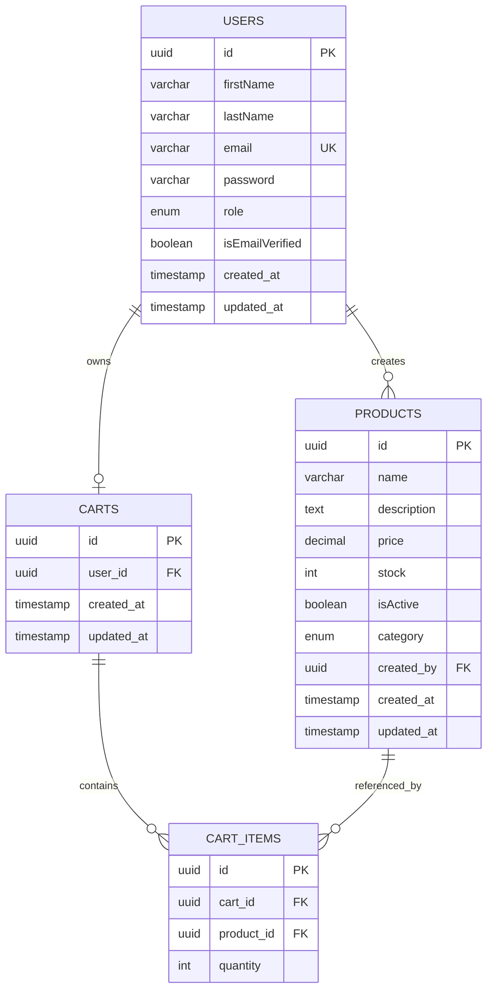
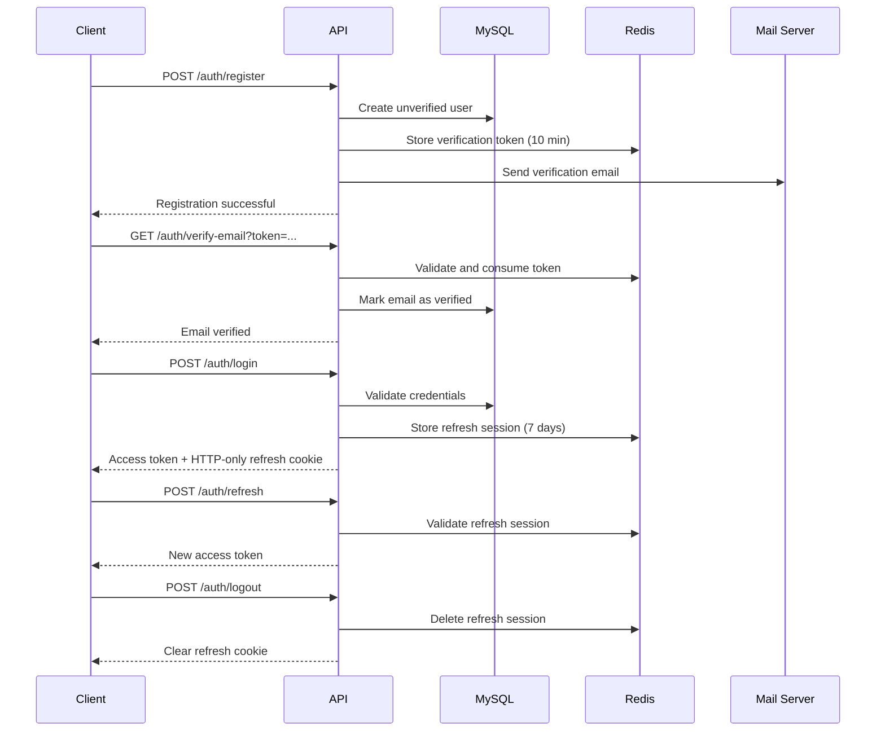

# E-Commerce API

A modular REST API for an e-commerce platform built with NestJS. The application provides user registration and email verification, JWT-based authentication, product management, Redis-backed sessions and caching, and authenticated shopping carts.

## Features

- User registration with Argon2 password hashing
- Email verification with time-limited Redis tokens
- Login, refresh-token, and logout flows
- HTTP-only refresh-token cookies
- Role-based access control for administrators
- Product CRUD operations with pagination
- Redis caching for individual products
- MySQL persistence through TypeORM migrations
- Health checks for MySQL and Redis
- Global request validation and throttling
- Swagger/OpenAPI documentation
- Docker Compose setup for the API, MySQL, and Redis

## Tech Stack

- **Runtime:** Node.js, TypeScript
- **Framework:** NestJS
- **Database:** MySQL
- **ORM:** TypeORM
- **Cache and sessions:** Redis
- **Authentication:** Passport, JWT, Argon2
- **Validation:** `class-validator`, `class-transformer`, Joi
- **Email:** Nodemailer, `@nestjs-modules/mailer`, EJS templates
- **API documentation:** Swagger / OpenAPI
- **Package manager:** pnpm
- **Containerization:** Docker and Docker Compose

## Architecture Diagram



## Project Structure

```text
src/
├── auth/                 Authentication, JWT strategy, sessions, email verification
├── cart/                 Cart and cart-item controllers, entities, and providers
├── config/               Environment-backed application configuration
├── database/             TypeORM data source and migrations
├── health/               MySQL and Redis health checks
├── mail/                 Mail module, service, and EJS templates
├── product/              Product CRUD, entities, providers, and cache service
├── redis/                Global Redis module and Redis service
├── shared/               Guards and request decorators
├── users/                User management, entities, DTOs, and providers
├── app.module.ts         Root module and global configuration
└── main.ts               Application bootstrap, validation, Swagger, and server setup
```

## Database Design

The application uses four main tables:

- **users:** identity, credentials, role, and email-verification state
- **products:** product details, price, stock, category, active state, and creator
- **carts:** one cart per user
- **cart_items:** products and quantities belonging to a cart

Important relationships:

- One user can create many products.
- One user has at most one cart.
- One cart has many cart items.
- Each cart item references one product.
- Deleting cart items when a cart is deleted is configured with cascade behavior.
- Product and user deletion are currently restricted by related foreign keys.

The schema is created and changed through TypeORM migrations. Runtime synchronization is disabled with `synchronize: false`.

## ER Diagram



## Authentication & Authorization

Authentication uses two JWT types:

- **Access token:** short-lived token returned in the login response and sent with `Authorization: Bearer <token>`.
- **Refresh token:** longer-lived token stored in an HTTP-only cookie named `refresh_token`.

The JWT strategy extracts the access token from the Authorization header and places the authenticated `userId` and `role` on the request.

Authorization is enforced with:

- `JwtAuthGuard` for authenticated routes
- `RolesGuard` and `@Roles(UserRole.ADMIN)` for administrator routes
- `@Authorized('userId')` to access the authenticated user id in controllers

Administrator emails are configured through `ADMIN_EMAILS` during registration.

## Authentication Flow



## Redis & Session Management

Redis is provided by the global `RedisModule` and is used for:

- Refresh-token sessions: `session:<session-id>` with a seven-day TTL
- Email-verification tokens: managed by `EmailVerificationService` with a ten-minute TTL
- Product cache: `product:<product-id>` with a ten-minute TTL

Product cache entries are read on product lookup, written after a cache miss, and invalidated on product update or deletion.

## API Documentation

The API uses the following base URL:

```text
http://localhost:3000/api/v1
```

Swagger UI is available at:

```text
http://localhost:3000/api
```

Main route groups:

| Group    | Selected endpoints                                                                                             | Access                                                 |
| -------- | -------------------------------------------------------------------------------------------------------------- | ------------------------------------------------------ |
| Auth     | `POST /auth/register`, `GET /auth/verify-email`, `POST /auth/login`, `POST /auth/refresh`, `POST /auth/logout` | Public, except session-dependent operations            |
| Users    | `GET /users/me`, `GET /users/all`, `PATCH /users/update`, `PATCH /users/password`, `DELETE /users/delete`      | Authenticated; user listing is admin-only              |
| Products | `GET /product/:id`                                                                                             | Public                                                 |
| Products | `GET /product/all`, `POST /product/create`, `PATCH /product/update/:id`, `DELETE /product/delete/:id`          | Admin workflow; ownership is also checked by providers |
| Cart     | `GET /cart/all`, `POST /cart/items`, `PATCH /cart/items/:id`, `DELETE /cart/items/:id`, `DELETE /cart/clear`   | Authenticated                                          |
| Health   | `GET /health`                                                                                                  | Public                                                 |

## Getting Started

### Prerequisites

- Node.js 24 or a compatible modern Node.js version
- pnpm 12+
- MySQL 8+
- Redis 7+
- SMTP credentials for email verification

Docker Compose can provide MySQL, Redis, and the API without installing the database services locally.

### Environment Variables

Create a `.env` file in the project root. Do not commit real secrets.

```dotenv
NODE_ENV=development
PORT=3000
APP_URL=http://localhost:3000/api/v1

ADMIN_EMAILS=admin@example.com

DATABASE_PORT=3306
DATABASE_USERNAME=root
DATABASE_PASSWORD=change-me
DATABASE_HOST=localhost
DATABASE_NAME=e-commercial

REDIS_URL=redis://localhost:6379

JWT_ACCESS_SECRET=change-me-access-secret
JWT_ACCESS_EXPIRATION=10m
JWT_REFRESH_SECRET=change-me-refresh-secret
JWT_REFRESH_EXPIRATION=7d

MAIL_HOST=sandbox.smtp.mailtrap.io
SMTP_USERNAME=your-smtp-username
SMTP_PASSWORD=your-smtp-password
```

For Docker Compose, the API container must connect to the Redis service by its Compose hostname:

```dotenv
DATABASE_HOST=mysql
REDIS_URL=redis://redis:6379
```

The application validates required environment variables at startup.

### Run the Project

Run TypeORM migrations before starting the API:

```bash
pnpm migration:run
pnpm start:dev
```

## Docker

Start the full development stack:

```bash
docker compose up --build
```

The Compose setup starts:

- API at `http://localhost:3000`
- MySQL exposed at host port `3307`
- Redis exposed at host port `6379`

The API container runs migrations and then starts the development server. For container-to-container communication, use `mysql` and `redis` as hostnames in the API environment.

## API Examples

### Register

```bash
POST http://localhost:3000/api/v1/auth/register
  Content-Type: application/json
  {
    "firstName": "Jane",
    "lastName": "Doe",
    "email": "jane@example.com",
    "password": "StrongPassword123!"
  }
```

Verify the email using the token sent by the configured mail provider:

```bash
GET http://localhost:3000/api/v1/auth/verify-email?token=<verification-token>
```

### Login

```bash
POST http://localhost:3000/api/v1/auth/login
  Content-Type: application/json
  {
    "email": "jane@example.com",
    "password": "StrongPassword123!"
  }
```

The response contains an access token. The refresh token is stored in `cookies.txt`.

### Get the Current User

```bash
GET http://localhost:3000/api/v1/users/me
Authorization: Bearer <access-token>
```

### Add an Item to the Cart

```bash
POST http://localhost:3000/api/v1/cart/items
  Authorization: Bearer <access-token>
  Content-Type: application/json
  {
    "productId": "<product-id>",
    "quantity": 2
  }
```

### Refresh the Access Token

The refresh token is sent automatically using the authentication cookie.

```bash
POST http://localhost:3000/api/v1/auth/refresh
```

## Security

- Passwords are hashed with Argon2 before storage.
- Access tokens are short-lived and signed with a dedicated secret.
- Refresh tokens are stored in HTTP-only cookies and checked against Redis sessions.
- Email verification tokens expire automatically.
- DTO validation uses whitelisting and rejects non-whitelisted properties.
- Authentication and role guards protect private and administrative routes.
- Global and auth-specific throttling reduce abusive request rates.
- Secrets and SMTP credentials must be supplied through environment variables.
- Production deployments should use HTTPS, secure cookie settings, secret rotation, and a managed secret store.
